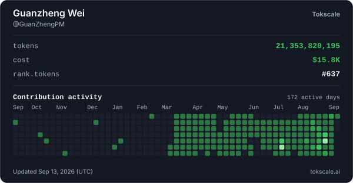

  
  
  

**LLM Product Manager · Agent Builder.** I work on coding agents, agent
harnesses, local ASR, and the tooling used to evaluate and operate them. The
projects below come from hands-on use and local experiments.

**大模型产品经理 · Agent Builder。** 主要方向包括 Coding Agent、Agent Harness、本地 ASR，以及相关的评测与运行工具。下面的项目来自日常使用和本地实验。

## 🔥 Token Furnace / Token 使用记录

> Public activity snapshot from my day-to-day use of AI development tools.
>
> 这里展示我日常使用 AI 开发工具的公开记录。

Cost shown is the API list-price equivalent; actual usage runs on subscription plans. Cached hourly from [tokscale.ai](https://tokscale.ai). 
费用按 API 公开价格等值估算，实际使用基于订阅方案；卡片每小时从 [tokscale.ai](https://tokscale.ai) 更新缓存。

## 🛠️ What I'm Building / 正在做的项目

### [longtime-agent](https://github.com/GuanZhengPM/longtime-agent)

Long-horizon coding-agent harness with durable state and evidence-gated completion. 
具备持久状态和以证据为门槛的完成判定机制的长周期 Coding Agent Harness。

### [AAA-Agent](https://github.com/GuanZhengPM/AAA-Agent)

An AI coding agent built from scratch in TypeScript. 
使用 TypeScript 从零构建的 AI Coding Agent。

### [agent-merge](https://github.com/GuanZhengPM/agent-merge)

Save-points, parallel timelines, and failure bisection for agent work. 
为 Agent 工作提供存档点、并行时间线和故障二分定位。

### [Agent Learning Gate](https://github.com/GuanZhengPM/agent-learning-gate)

Evidence, scope, and approval checks for durable agent memory, rules, and skills. 
面向 Agent 长期记忆、规则和 Skill 写入的证据、作用域与授权检查。

### [TurnAlign](https://github.com/GuanZhengPM/TurnAlign)

Model-replaceable streaming ASR orchestration with timestamps and speaker diarization. 
支持模型替换、时间戳和说话人分离的流式 ASR 编排。

### [DayAudio](https://github.com/GuanZhengPM/DayAudio)

Local batch processing for day-long recordings: resumable ASR, file-local speaker tracks, explicit owner profiles, and evidence-linked summaries. 
面向全天录音的本地批处理：可恢复 ASR、文件内说话人轨、显式主要说话人（owner）档案和证据关联摘要。

### [guanzhengpm.github.io](https://github.com/GuanZhengPM/guanzhengpm.github.io)

Notes on agents, evaluations, and LLM product work. 
关于 Agent、评测和大模型产品工作的博客笔记。

## 🐍 Contribution Snake / 贡献记录

  <picture>
    <source media="(prefers-color-scheme: dark)" srcset="https://raw.githubusercontent.com/GuanZhengPM/GuanZhengPM/output/github-contribution-grid-snake-dark.svg">
    
  </picture>

