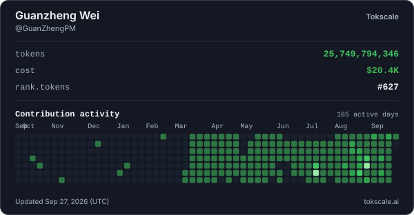

  
  
  
  
  

## 🛠 What I'm Building · 正在做的项目

<table>
<thead>
<tr><th align="left" width="230">Project</th><th align="left">What it does</th></tr>
</thead>
<tbody>
<tr><td colspan="2"><b>Agent Harness</b></td></tr>
<tr>
  <td><a href="https://github.com/GuanZhengPM/looongtime-agent">looongtime-agent</a></td>
  <td>Runs long coding tasks and saves progress so work can resume after an interruption. Checks scripts and tests to decide whether a task is complete. 针对长程编码任务做优化。保存任务进度，支持中断后继续，通过脚本和测试检查完成情况。</td>
</tr>
<tr>
  <td><a href="https://github.com/GuanZhengPM/agent-merge">agent-merge</a></td>
  <td>Runs agents in separate Git worktrees, compares their changes with tests, and keeps a record of each attempt. 让多个Agent在独立Git worktree中并行处理任务，通过测试比较修改结果，保留每次尝试的记录。</td>
</tr>
<tr>
  <td><a href="https://github.com/GuanZhengPM/agent-learning-gate">agent-learning-gate</a></td>
  <td>Checks what an agent should save to memory, rules, or skills, and records rejected approaches to avoid repeating them. 在Agent写入记忆、规则或Skill前，检查依据和适用范围。保留被否决的方案，避免新会话重复尝试。</td>
</tr>
<tr><td colspan="2"><b>Speech · 语音</b></td></tr>
<tr>
  <td><a href="https://github.com/GuanZhengPM/TurnAlign">TurnAlign</a></td>
  <td>Streaming speech recognition with timestamps and speaker labels. Supports replacing the recognition model. 流式语音识别，输出时间戳和说话人信息，支持更换识别模型。</td>
</tr>
<tr>
  <td><a href="https://github.com/GuanZhengPM/DayAudio">DayAudio</a></td>
  <td>Transcribes long recordings locally, resumes interrupted work, and links summaries to the original audio. 在本地转写长时间录音，支持中断后继续。识别不同说话人，摘要可定位到原始音频。</td>
</tr>
<tr><td colspan="2"><b>Tools · 工具</b></td></tr>
<tr>
  <td><a href="https://github.com/GuanZhengPM/paper-resume">纸页简历 · Paper Resume</a></td>
  <td>Edit resumes in Markdown and export PDFs. Adjust layout in the browser or through an agent using the CLI. 用Markdown编辑简历，导出PDF。可以在页面调整排版，也可以让Agent通过CLI修改。</td>
</tr>
<tr><td colspan="2"><b>Blog · 博客</b></td></tr>
<tr>
  <td><a href="https://guanzhengpm.github.io/">guanzhengpm.github.io</a></td>
  <td>Notes on agents, evaluation and LLM product work. 关于 Agent、评测与大模型产品的笔记。</td>
</tr>
</tbody>
</table>

## 🔥 Token Furnace · Token 使用记录

